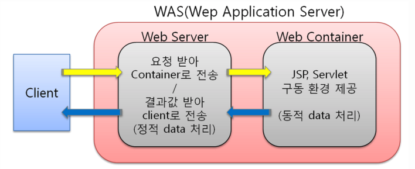

# Apache와 Tomcat


## Apache

HTTP 웹 서버이다. 


## 웹 서버 (Web Server)

웹 서비스를 제공하는 서버로, 웹 서버에 접속하기 위해서는 웹 브라우저가 필요하다. 일반적으로 우리는 웹 브라우저를 통해 웹 서버에서 지원하는 서비스를 제공받느다.


## Tomcat

웹 어플리케이션 서버로 자바 서블릿을 실행시키고 JSP 코드가 포함되어 웹 페이지를 보여준다. 일반적으로 톰켓은 웹 서버인 아파치로부터 전달받은 동적 페이지를 읽어 프로그램을 실행시키고, 그에 대한 결과를 HTML로 재구성하여 아파치에게 전달한다.


## 웹 어플리케이션 서버 (WAS, Web Application Server)

인터넷 상에서 HTTP를 통해 어플리케이션을 수행시켜주는 미들웨어(소프르웨어 엔진)이다. 웹 어플리케이션 서버는 웹 서버와 웹 컨테이너가 결합한 형태로, 다양한 기능을 웹 컨테이너로 구현하여 다영한 역할을 수행할 수 있는 서비이다.


## 웹 컨테이너 (Web Container)

JSP와 서블릿을 이용하는 웹 어플리케이션 프로그램은 자바 언어를 이용하여 작성할 수 있으며, JSP와 서블릿을 실행 시킬 수 있는 소프트웨어를 말한다.

웹 서버에서 JSP를 요청하면 톰캣에서는 JSP 파일을 서블릿으로 변환하여 컴파일을 실행하고, 서블릿의 수행 경과를 웹 서버에게 전달한다.


## 웹 서버와 웹 어플리케이션의 차이




사용 목적에 다르기 때문에 웹 서버와 웹 어플리케이션 서버는 분리된다. 웹 서버의 경우 정적 데이터(html 등)를 담당하는 서버이며, 정적 데이터를 다루기 때문에 웹 어플리케이션 서버에 비해 안정적이고 더 빠르다. 반면에 웹 어플리케이션 서비는 동적인 데이터를 담당한다. 데이터이베이스와 연동하여 데이터를 가공하거나 송수신하며, 프로그램으로 데이터를 조작하는 경우에도 사용된다.

```
토비의 글 중

 많은 개발자들이 애플리케이션 서버로 톰캣을 사용하는 경우에 스태틱 파일(html, css, js, 이미지)은 톰캣 앞에 아파치 웹 서버(Httpd)를 두어서 처리하게 하는 것이 좋다고 생각한다. 외부의 요청은 일단 Apache Httpd가 받고, 톰캣 내에서 처리할 자바 애플리케이션만 톰캣으로 다시 전달해서 처리하고 그 외의 리소스는 Apache Httpd가 직접 처리하게 만들어야 성능이 좋다고 생각한다. 자바로 만든 서버인 톰캣은 스태틱 파일 처리에서 Apache Httpd만 못하다는 것이 그 이유다.
 
 하지만 톰캣과 Httpd의 개발자에 따르면 이는 개발자들이 잘못 알고 있는 미신이다. 아직도 톰캣 3를 사용하고 있는 것이 아니라면 말이다.

  자세한 내용은 Myth or truth: one should always use Apache httpd in front of Apache Tomcat to improve performance?에 잘 나와있다. 지금은 스프링 소스의 직원이 된 아파치 톰캣과 Httpd 의 핵심 개발자들이 직접 작성한 내용이다.
  
톰캣은 5.5부터 Httpd의 native 모듈을 사용해서 스태틱 파일을 처리하는 기능을 제공한다. 이 경우 Httpd와 톰캣이 같은 모듈을 사용하는 셈이니 성능에서 차이가 날 이유가 없다. 실제 테스트 한 결과를 봐도 톰캣에서 아파치 Native 모듈을 사용하는 것이 순수하게 아파치 Httpd만 사용하는 것과 비교해서 성능이 전혀 떨어지지 않는다.

  따라서 단지 스태틱 파일 처리의 성능만을 위해서라면 굳이 톰캣 앞에 Apache Httpd를 두는 것은 불필요하다. 오히려 메모리만 많이 먹고, 관리부담은 커지고, 불필요한 부하만 걸릴 뿐이다.
  
  물론 Httpd의 다른 기능이나 모듈을 사용해야 할 필요가 있다면 그때는 Httpd를 앞에 두고 사용해야겠지만. 예를 들어 하나의 서버에서 PHP 애플리케이션과 자바 애플리케이션을 함께 사용하거나, Httpd 서버를 간단한 로드밸런싱을 위해서 사용해야 하는 경우라면 Httpd를 앞에 두고 톰캣을 연결해서 사용하도록 하면 될 것이다.
```


```
httpd는 웹 서비스를 위한 아파치 데몬으로, html, cgi를 사용할 수 있게 한다. 기본적으로 리눅스 환경에서 웹 서버를 사용할 경우 필수적이다.
```

