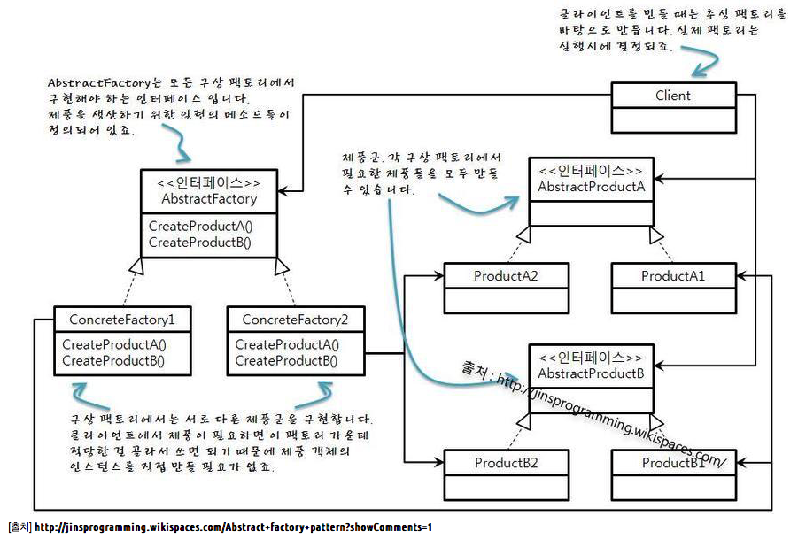

# 01. Abstract Factory

추상 팩토리(Abstract Factory)는 상세화된 서브 클래스를 정의하지 않고도 서로 관련성이 있거나 독립적인 여러 객체의 군을 생성하기 위한 인터페이스를 제공한다.

if/else 구문을 없애고 서브 클래스마다 팩토리 클래스를 갖게함으로써,  넘겨주는 객체에 따라 서브 클래스를 반환한다.


### 활용성

- 객체가 생성되거나 구성, 표현되는 방식과 무관하게 시스템을 독립적으로 만들고자 할 때
- 여러 제품군 중 하나를 선택해서 시스템을 설정해야 하고 한번 구성한 제품을 다른 것으로 대체할 수 있을 때
- 관련된 제품 객체들이 함께 사용되도록 설계되었고, 이 부분에 대한 제약이 외부에도 지켜지도록 하고 싶을 때
- 클래스 라이브러리를 제공하고, 구현이 아닌 인터페이스를 노출하고 싶을 때


### 특징

- 구체적인 클래스를 분리한다.

  - 추상 팩토리 패턴은 어플리케이션에서 생성할 객체의 클래스를 제어할 수 있다.

  - 객체를 생성하는 과정과 책임을 캡슐화함으로써, 구체적인 구현 클래스를 사용자에서 분리할 수 있다.

  - 추상 인터페이스를 통해 인스턴스를 조작한다.

- 제품군을  쉽게 대체할 수 있다.

  - 구상 팩토리를 변경함으로써 어플리케이션은 서로 다른 제품을 사용할 수 있다.
  - 추상 팩토리는 필요한 모든 것을 생성하기 때문에 전체 제품군은 한 번에 변경이 가능하다.

- 제품 사이의 일관성을 증진시킨다.

  - 어플리케이션은 한 번에 오직 한 군에서 만든 객체를 사용하도록 함으로써 프로그램의 일관성을 갖게 한다.

- 새로운 종류의 제품을 제공하기 어렵다.

  - 추상 팩토리는 생성할 수 있는 제품 집합에만 고정되어 있기 때문에, 새로운 종류의 제품을 만들기 위해 기존 추상 팩토리를 확장하기가 쉽지 않다.
  - 새로운 종류의 제품이 등자하면 팩토리의 구현을 변경해야 하며, 이는 추상 팩토리와 서브 클래스들의 변경을 가져온다.



```java
// Abstract Product
public abstract class Product {

    public abstract String getName();

    public abstract  int getPrice();

    @Override
    public String toString() {

        return "Product name: " + getName() + ", price: " + getPrice();
    }
}

// Product Computer

public class Computer extends Product{
    String name;
    int price;

    public Computer(String name, int price) {
        this.name = name;
        this.price = price;
    }

    @Override
    public String getName() {
        return name;
    }

    @Override
    public int getPrice() {
        return price;
    }
}

// Product Ticket
public class Ticket extends Product {

    String name;
    int price;

    public Ticket (String name, int price) {
        this.name = name;
        this.price = price;
    }


    @Override
    public String getName() {
        return name;
    }

    @Override
    public int getPrice() {
        return price;
    }
}
```


```java
// Abstract Factory
public interface ProductAbstractFactory { 
    
    public Product createProduct();

}

// Concrete Computer Factory
public class ComputerFactory implements ProductAbstractFactory {

    String name;
    int price;

    public ComputerFactory(String name, int price) {
        this.name = name;
        this.price = price;
    }

    @Override
    public Product createProduct() {
        return new Computer(this.name, this.price);
    }
}

// Concrete Ticket Factory
public class TicketFactory implements ProductAbstractFactory {
    String name;
    int price;

    public TicketFactory(String name, int price) {
        this.name = name;
        this.price = price;
    }

    @Override
    public Product createProduct() {
        return new Ticket(this.name, this.price);
    }
}
```


```java
public class ProductFactory {

    public static Product createProduct(ProductAbstractFactory productAbstractFactory) {
        return productAbstractFactory.createProduct();
    }
}

public class main {

    public static void main(String[] args) {

        Product computer = ProductFactory.createProduct(new ComputerFactory("computer", 5));
        Product ticket = ProductFactory.createProduct(new TicketFactory("Ticket", 10));

        System.out.println(computer.toString());
        System.out.println(ticket.toString());
    }
}

```

