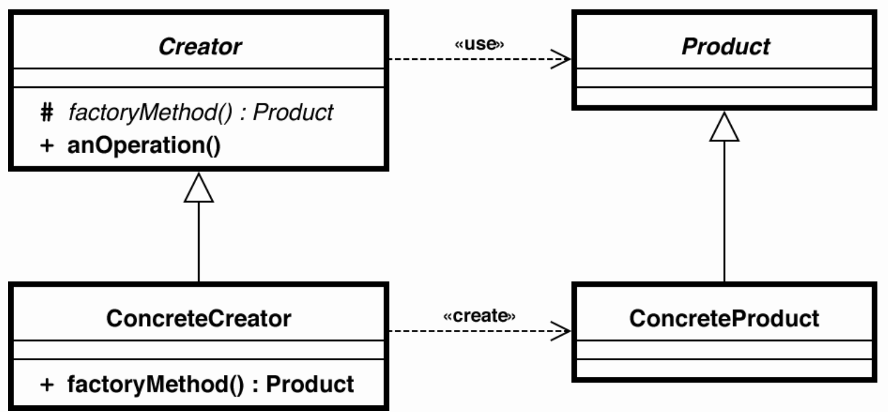

# 팩토리 메서드 (Factory Method)

객체를 만들어 내는 부분은 서브클래스에 위임하는 패턴으로, 객체를 생성하기 위해 인터페이스를 정의하지만, 어떤 클래스의 인스턴스를 생성하는지에 대한 결정은 서브클래스가 내리도록 한다.

### 동기

어떤 상품을 만들지에 대한 결정에 따라 인스턴스로 생성되어야 할 서브클래스가 달라지기 때문에, 상품 클래스는 어떤 상품의 인스턴스를 생성해야 하는지 미리 예측할 수 없다.

추상 클래스는 인스턴스를 가질 수 없으며, 추상 클래스 밖에 모르는 프레임워크는 클래스의 인스턴스화 작업을 수행할 수 없다.

상품 클래스의 서브클래스는 추상화된 CreateProduct() 연산을 재정의함으로써, 특정 상품 클래스의 서브클래스를 반호나해야 한다. 상품 클래스의 서브클래스가 인스턴스화되면 어플리케이션에 따른 상품의 인스턴스가 된다. 이때 CreateProduct() 메소드는 객체를 생성하는 방법을 알기에 **팩토리 메소드**라 한다.



### 협력 방법

Creator는 자신의 서브클래스를 통해 실제 필요한 팩토리 메서드를 정의하여 적절한 ConcreteProduct의 인스턴스를 반환할 수 있게 한다.

### 결과

팩토리 메서드 패턴은 어플리케이션에 국한된 클래스가 사용자의 코드에 종속되지 않도록 한다.

어플리케이션은 인터페이스와 동작하도록 만들어지며, 사용자가 정의한 어떤 ConcreteProduct 클래스와 동작할 수 있게 된다.

- 서브클래스에 대한 훅(hook) 메소드를 제공한다.

```
슈퍼클래스에서 디폴트 기능을 정의해두거나 비워뒀다가 서브클래스에서 선택적으로 오버라이드할 수 있도록 만들어둔 메소드를 훅(hook) 메소드라고 한다. 서브클래스에서는 추상 메소드를 구현하거나, 훅 메소드를 오버라이드하는 방법을 이용해 기능의 일부를 확장한다. 

출처: http://chouingchou.tistory.com/13 [Hello, World?]
```


- 병렬적인 클래스 계통을 연결하는 역할을 담당한다.

  병렬적 클래스 계통은 클래스가 자신의 책임을 분리된 다른 클래스에 위임할 때 발생된다. 


## 예제

```java
public interface Product {

    public void use();
}

public abstract class ProductCreator {

    // 팩토리 메소드 패턴에는 템플릿 패턴이 내재되어 있다.
    public Product create() {

        // step 1
        getProductInfo();

        // step 2
        Product product = createProduct();

        // step 3
        createProductLog();

        return product;
    }

    // 알고리즘을 생성하기 전, 아이템 정보 요청
    abstract protected void getProductInfo();

    // 아이템 생성 등의 로그 저장
    abstract protected void createProductLog();

    // 아이템 생성
    abstract protected Product createProduct();
}

```


```java
public class Keyboard implements Product{

    @Override
    public void use() {

        System.out.println("used Keyboard");
    }
}

public class Mouse implements Product {

    @Override
    public void use() {

        System.out.println("used Mouse");
    }

}
```


```java
import java.util.Date;

public class KeyboardCreator extends ProductCreator {
    @Override
    protected void getProductInfo() {

        System.out.println("get Product Info: Keyboard Information");
    }

    @Override
    protected void createProductLog() {

        System.out.println("create Product Log: created New Keyboard - " + new Date());
    }

    @Override
    protected Product createProduct() {

        return new Keyboard();
    }
}


import java.util.Date;

public class MouseCreator extends ProductCreator {
    @Override
    protected void getProductInfo() {

        System.out.println("get Product Info: Mouse Information");
    }

    @Override
    protected void createProductLog() {

        System.out.println("create Product Log: created New Mouse - " + new Date());
    }

    @Override
    protected Product createProduct() {

        return new Mouse();
    }
}

```


```java
public class MainClass {

    public static void main(String[] args) {

        ProductCreator creator = new KeyboardCreator();
        Product product = creator.create();
        product.use();

        creator = new MouseCreator();
        creator.create();
        product.use();

    }
}

```


## ref

