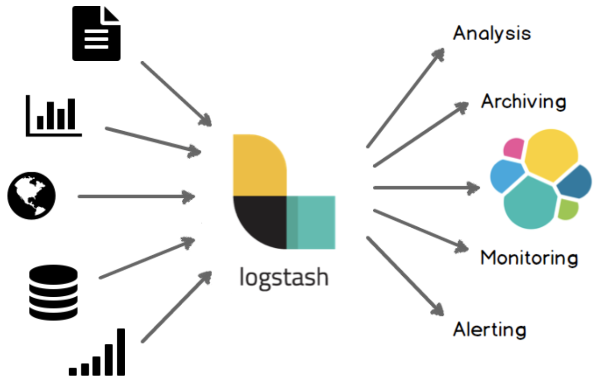

# Elasticsearch

-----

## index

- Elasticsearch
- Logstash
- Kibana

-----

## Elasticsearch

엘라스틱서치(Elasticsearch)는 확장성이 뛰어난 오픈 소스 전체 텍스트 검색 및 분석 엔진이다. 대량의 데이터를 신속하고 거의 실시간으로 저장, 검색 및 분석할 수 있다. 여기서 거의 실시간(NRT, Near Realtime)의 의미는 문서를 색인할 때부터 검색이 가능할 때 까지 걸리는 시간이 1초 정되 됨을 의미한다. 일반적으로 복잡한 검색 기능과 요구 사항이 있는 어플리케이션을 구동하는 기본 엔진/기술로 사용된다.

- 고객이 판매하는 제품을 검색할 수 있는 온라인 웹 스토어에서, 엘라스틱서치는 전체 제품 카탈로그 및 인벤토리를 저장, 검색 및 자동 완성 제안 기능을 제공할 수 있따.
- 로그 또는 트랙젝션 데이터를 수집하고 분석 및 조사함으로써, 추세, 통계, 요약, 예외 등의 정보를 수집하는 경우, 로그스테이시(Elasticsearch/Logstash/Kibana 스택의 일부)를 사용하여 데이터를 수집하고 집계 및 구문 분석 처리 후 엘라스틱서치에게 제공한다. 결과적으로 데이터는 엘라스틱서치에 저장되고, 집계 및 검색을 실행하여 특정 정보를 조회할 수 있다.
- 고객에 어떤 상품에 대해서 특정 가격 이하로 떨어지면 알림을 받고 싶어하는 경우, 공급 업체 가격을 끌어와 엘라스틱서치에 저장하고 역방향 검색(Percolator) 기능을 사용하여 가격 변동을 고객 쿼리와 비교하고 일치하는 항목을 발견할 경우 고객에서 알림을 보낼 수 있다.
- 분석 또는 비즈니스 인텔리전스 요구사항을 갖고, 많은 데이터에 대해 신속하게 조사하거나 분석하거나 시각화하거나 에드혹 질문을 요구하길 원한다. 이러한 경우 엘라스틱서치를 사용하여 데이터를 저장한 후, 키바나를 사용하여 중요한 데이터를 시각화 할 수 있는 사용자 정의 대시 보드를 작성할 수 있다. 또한 엘라스틱서치의 집계 기능을 사용하여 데이터에 대한 복잡한 비즈니스 인털레전스 쿼리를 수행할 수 있다.

-----

## Logstash

로그스테이시(Logstash)는 실시간 파이프 라이닝 기능을 갖춘 오픈소스 데이터 수집 엔진이다. 서로 다른 소스의 데이터를 동적으로 통합하여 데이터를 원하는 대상으로 표준화 할 수 있다. 

로그스테이시는 원래 로그 수집에 대한 혁신을 가져왔다. 모든 유형의 이벤트는 광범위한 입력, 필터 및 출력 플러그인으로 푸웁해지고 변형 될 수 있으며 많은 원시(native) 코덱을 사용하여 처리 프로세스를 더욱 단순화 한다. 로그스테이시는 많은 양의 다양한 데이터를 활용하여 이해력을 높인다.

### The Power of Oogstash

- 엘라스틱서치와 키바나의 시너지를 통해, 수평적이고 확장 가능한 데이터 처리 라이프 라인

- 다양한 입력, 필터 및 출력을 믹스 또는 매칭 및 조화

- 200개 이상의 플러그인을 사용할 수 있으며, 자신만의 플러그인을 만들고 제공할 수 있는 유연성

### Logs ans Metrics

- 로깅(logging) 데이터의 모든 타입을 처리
  - 아파치와 같은 웹 로그 (log4j)
  - 네트워킹 및 방화벽 로드(syslog)
- Filebeat를 사용한 안정한 로그 전달 기능
- Ganglia, colletta, NetFlow, JMX 및 기타 여러 인프라 및 어플레케이션 플랫폼에서 TCP 및 UDP를 통해 매트릭스 수집

### The Web

- HTTP 요청을 이벤트로 변환
- 필요에 따라 HTTP 엔트 포인트를 폴링함으로써 이벤트 생성
  - 인터페이스의 상태, 성능, 메트릭 및 기타 유형의 데이터를 종합적으로 캡처
  - 수신을 넘어서 폴링의 제어가 선호되는 시나리오에 적합

### Data Stores and Streams 

이미 소유하고 있는 데이터에서 더 많은 가치를 찾을 수 있다.

- JDBC 인터페이스를 사용하여 관계형 데이터베이스 또는 NoSQL 저장소의 데이터를 더 잘 이해 할 수 있다.
- Apache Kafka, RabbitMQ, Amazon SQS와 같은 메시징 큐로부터 다양한 데이터 스트림을 통합할 수 있다.

### Sensors and IoT

다양한 데이터 탐색

- 거대한 IoT 세계에서 연결된 센서의 데이터를 캡처하고 활용함으로써 무한한 유스 케이스를 실현한다.
- 로그스테이시는 모바일 장치에서 인텔리전트 홈, 커넥티드카, 의료 센서 및 기타 여러 산업별 어플리케이션으로 전송되는 데이터 처리를 위한 공통 이벤트 수집 백본이다.

### Easily Enrich Everythingedit

로그스테이시는 패턴 일치, 지오 매핑(geo mapping), 동적 조회 기능과 함께 많은 집계 및 변화를 즉시 사용할 수 있다.

- Grok은 로그스테이시 필터와 밀접한 관계를 갖으며, 구조화되지 않은 데이터에서 구조를 만드는데에 아주 흔하게 사용된다. 웹, 시스템, 네트워킹 및 시타 유형의 이벤트 형식을 신속하게 해결하는데 도움을 준다.
- IP 주소에서 지리적 좌표를 해독하고, 날짜 복잡도를 정규화하고, key - value 또는 CSV 데이터를 단순화하고, 민감하 정보를 핑거프린팅(fingerprinting, anonymizing, 익명 처리)하고 로컹 조회 또는 엘라스틱서치 쿼리로 데이터를 다양하게 함으로써 시야 확장
- 코덱은 JSON 및 멀티라인 이벤트와 같은 공통 이벤트 구조의 처리를 쉽게하기 위해 종종 사용된다.

-----

## Kibana

키바나(Kibana)는 엘라스틱서치와 함께 작동하도록 설계된 오픈소스 분석 및 시각화 플랫폼이다. 엘라스틱서치 색인에 저장된 데이터를 search, view, interact 할 수 있다. 진보된 데이터를 쉽게 분석할 수 있고, 다양한 차트, 테이블 및 맵에서 시각화 할 수 있다.

키바나를 사용하면 많은 양의 데이터를 쉽게 이해할 수 있으며, 간단한 브라우저 기반의 인터페이스를 통해 실시간으로 엘라스틱서치 쿼리의 변경 사항을 표시하는 동적 대시 보드를 신속하게 만들고 공유할 수 있다.

설치가 간단하며, 짧은 시간만에 엘리스틱서치 인덱스를 탐색할 수 있다. 코드 또는 추가적인 인프라가 필요하지 않다.

-----

- [Elasticsearch Reference [6.3]](https://www.elastic.co/guide/en/elasticsearch/reference/current/getting-started.html)
- [Logstash Reference [6.3]](https://www.elastic.co/guide/en/logstash/current/introduction.html)
- [Kibana User Guide [6.3]](https://www.elastic.co/guide/en/kibana/current/introduction.html)