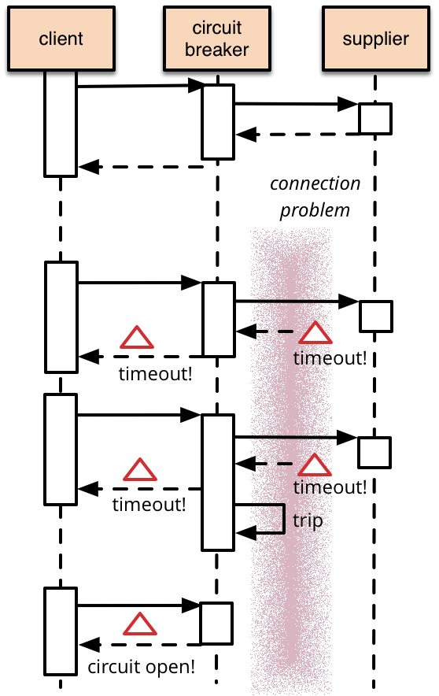

# Hystrix

Netfix에서 Circuit Breaker Pattern을 구현한 라이브러리이다. 

-----

## Circuit Breaker (by. Martin Fowler)

일반적으로 스프트웨어 시스템에서는 각기 다른 프로세스들에서 동작하는 소프트웨어를 원격 호출하도록 한다. 메모리 상에서의 호출과 원격 호출의 차이점 중 하나는, 원격 호출의 경우 fail이 일어날 수 있거나 어떤 타임아웃 제한에 다다를때 까지 응답을 주지않고 [Hang](#hang)이 걸릴 수 있다는 것이다. 이 문제는 응답이 없는 supplier에 많은 호출자가 묶인다면, 중요 자원의 고갈로 인해 여러 시스템에 거쳐 연쇄 Failure를 일으킬 수 있다. 이러한 치명적인 연쇄 Failure를 방지하기 위해 Circuit Breaker Pattern이 대중화 되었다.

Circuit Breaker의 기본적인 개념은 failure를 모니터링하는 Circuit Breaker Object에 protected function call을 래핑함으로써, failure가 특정 임계치에 다다르면, Circuit Breaker가 trip되고 그 후 추가 발생하는 Circuit Breaker를 호출하는 모든 호출들은 protected call이 전혀 이루어 지지 않고 에러를 리턴한다.



-----

## Circuit Breaker Pattern

서비스 호출 중간, 즉 Service A와 Service B 사이에 Circuit Breaker를 설치하여 Service B로의 모든 호출이 Circuit Breaker를 통하게 되고, Service B가 정상적인 상황에서는 트래픽을 문제없이 통과시킨다.

.png)

Service B와의 통신에서 문제가 발생하게 되는 경우, Circuit Breaker가 이를 감지하여 Service B로의 호출을 강제적으로 끊어 Service A의 스레드가 더 이상 응답을 기다리지 않도록하여 장애가 전파되는 것을 방지한다. 강제적으로 호출을 끊으면 에러 메시지가 Service A에서 발생하기 때문에 장애 전파는 막을 수 있지만, Service A에서 별도의 장애 처리 로직이 필요하다.

이를 발전 시킨 형태가 Fall-back Messaging이며, Circuit Breaker에서 Service B가 정상적인 응답을 할 수 없을 때, Circuit Breaker가 룰에 따라 다른 메시지를 리턴하는 방식이다. 

.png)

```
example.
Service A가 상품 목록을 화면에 뿌려주는 서비스이고, Service B가 사용자에 대해 머신러닝을 이용하여 상품을 추천해주는 서비스라고 가정할 때, Service B에서 장애가 발생하면 상품 추천을 할 수 없다. 
이때 미리 추천 상품 목록을 설정해놓고 Service B에서 장애가 날 경우 Circuit Breaker에서 미리 설정해 놓은 추천 상품 목록을 제공해줌으로써, 머신러닝 알고리즘 기반의 상품 추천보다는 정확도가 떨어지지만 최소한 시스템이 장애가 나는 것을 방지할 수 있다.
```

이 패턴은 넷플릭스에서 자바 라이브러리인 Hystrix로 구현이 되었으며, Spring 프레임워크를 통해 손쉽게 적용할 수 있다.

-----


#### circuitBreaker.requestVolumeThreshold

```
This property sets the minimum number of requests in a rolling window that will trip the circuit.

For example, if the value is 20, then if only 19 requests are received in the rolling window (say a window of 10 seconds) the circuit will not trip open even if all 19 failed.
```

이 속성은 회로를 트립 할 롤링 윈도우의 최소 요청 수를 설정합니다.

예를 들어, 값이 20 인 경우 롤링 창 (예 : 10 초)에서 19 개의 요청 만 수신 된 경우 모두 19 개가 실패하더라도 회로가 열리지 않습니다.

#### circuitBreaker.sleepWindowInMilliseconds

```
This property sets the amount of time, after tripping the circuit, to reject requests before allowing attempts again to determine if the circuit should again be closed.
```

이 속성은 회로를 트립 한 후 회로를 다시 닫아야하는지 다시 결정하기 전에 요청을 거부하도록 시간을 설정합니다.

#### circuitBreaker.errorThresholdPercentage

```
This property sets the error percentage at or above which the circuit should trip open and start short-circuiting requests to fallback logic.
```

이 속성은 오류 발생률을 회로가 열리는 이상으로 설정하고 단락 요청을 대체 논리로 시작합니다.

#### metrics.rollingStats.timeInMilliseconds

```
This property sets the duration of the statistical rolling window, in milliseconds. This is how long Hystrix keeps metrics for the circuit breaker to use and for publishing.

As of 1.4.12, this property affects the initial metrics creation only, and adjustments made to this property after startup will not take effect. This avoids metrics data loss, and allows optimizations to metrics gathering.

The window is divided into buckets and “rolls” by these increments.
```

이 속성은 통계 롤링 창의 기간을 밀리 초 단위로 설정합니다. 이것은 Hystrix가 회로 차단기가 사용하고 게시하기위한 측정 기준을 얼마나 오래 유지하는지입니다.

1.4.12부터이 속성은 초기 메트릭 생성에만 영향을 주며 시작 후이 속성에 대한 조정은 적용되지 않습니다. 이렇게하면 메트릭 데이터 손실을 방지하고 메트릭 수집을 최적화 할 수 있습니다.

창은 이러한 증분에 따라 양동이와 "롤"로 나뉩니다.


### example

```
@HystrixCommand(fallbackMethod = "thresholdTest2",
            commandProperties = {
            @HystrixProperty(name = "circuitBreaker.requestVolumeThreshold", value = "3"),
            @HystrixProperty(name = "circuitBreaker.sleepWindowInMilliseconds", value = "50000"),
            @HystrixProperty(name = "metrics.rollingStats.timeInMilliseconds", value = "10000")
    })
```

오류 감시 시간 10초 내에, 3번 이상의 요청이 있었고, 그 요청 중 오류율이 50% 이상일 경우 Circuit Breaker가 작동하여 fallback 메소드가 호출된다. Circuit Breaker는 50초 동안 동작하며, 50초 이후 원래 로직 흐름으로 돌아간다.

오류 감시 시간 내에 요청이 반드시 3번 이상이어야 하며, 2번의 요청만 들어오고 2번의 요청 모두 실패하고 감시 기간 10초가 지나게 되면 Circuit Breaker는 작동하지 않는다.


-----

## Hang

컴퓨팅에서 컴퓨터 프로그램이나 시스템이 입력에 응답하지 않을 때 정지(hang || freeze)가 발생한다. 

hang에는 무한 루프, 장시간 중단할 수 없는 컴퓨팅, 자원 고갈 (thrashing), 성능이 좋지 않은 하드웨어(throttling), 느린 컴퓨터 네트워크와 같은 외부 이벤트, 잘못된 설정, 호환성 문제 등과 같이 소프트웨어 또는 하드웨어 문제를 비롯하여 다양한 원인과 증상이 있다.


----

#### Ref

- [마틴 파울러가 작성한 CircuitBreaker 내용 해석](http://egloos.zum.com/pulgrims/v/3047353)
- [Circuit breaker 패턴을 이용한 장애에 강한 MSA 서비스 구현하기 #1 - Circuit breaker와 넷플릭스 Hystrix [조대협의 블로그]](http://bcho.tistory.com/tag/하이스트릭스)
- [Netflix-How it Works](https://github.com/Netflix/Hystrix/wiki/How-it-Works)
- [Circuit Breaker](https://spring.io/guides/gs/circuit-breaker/)
- [javadoc-netflix-hystrix](http://netflix.github.io/Hystrix/javadoc/)
- [1](https://medium.com/@goinhacker/hystrix-500452f4fae2)
- [2](https://github.com/spring-projects/spring-cloud/wiki/Spring-Cloud-Edgware-Release-Notes)
- [3](https://supawer0728.github.io/2018/03/11/Spring-Cloud-Hystrix/)
- [4](https://spring.io/guides/gs/circuit-breaker/)

