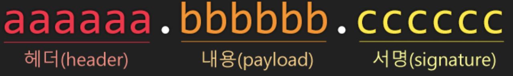

# JWT(Json Web Token)

- 개요
- 구조
- Ref

------

## 개요

어플리케이션이 사용자가 누구인지 확인하는 과정을 인증(Authentication)이라 한다. 기본적으로 어플리케이션은 세션 아이디를 기반으로하는 세션 쿠키를 통해 서버측에 사용자의 식별자(Identiry)를 저장하고 값을 유지한다. 

세션 아이디 대신에 토큰을 사용해서 서버측 부하를 낮출 수 있고 능률적인 접근 권한 관리를 할 수 있으며, 분산/클라우드 기반 인프라 스트럭처에 대해 장 대응할 수 있다.  기본적으로 토큰 인증에서는 사용자가 확인 가능한 증명서를 제시했을 때 토큰이 생성된다. 최초의 인증은 보통 사용자 이름과 암호를 통해 이루어지며, API 키 또는 다른 서비스에서 발급된 토큰을 사용할 수 있다.

Json Web Token은 웹 표준으로서 두 개체에서 JSON 개체를 사용하여 가볍고  자가수용적인(Self-Contained) 방식으로 정보를 안정성있게 전달한다.

JWT는 C, Java, Python, C++, R, C#, PHP, JavaScript, Ruby, Go, Swift 등 대부분의 프로그래밍 언어에서 지원한다. 

필요한 모든 정보를 자체적으로 지니고 있으며, JWT 시스템에서 발급된 토큰은 토큰에 대한 기본 정보, 전달할 정보, 검증된 토큰에 대한 Signature를 포함한다.

웹 서버의 경우 HTTP 헤더에 넣어서 전달이 가능하며, URL의 파라미터로 전달 할 수 있다.

주로 회원 인증, 정보 교류에서 사용된다. 회원 인증에서는 유저가 로그인을 하면, 서버는 유저의 정보에 기반한 토큰을 발급하여 유저에게 전달한다. 그 후, 유저가 서버에 요청을 할 때 마다 JWT를 포함하여 전달한다. 서버가 클라이언트에게 요청을 받을 때마다, 전달받은 토큰의 유효성 검사 후, 유저가 요청한 작어벵 대한 권한이 있는지 확인하여 작업을 처리한다. 정보 교류는 두 개체 사이에서 안정성 있게 정보를 교호나하기에 좋은 방법이다. 정보가 sign이 되어 있기 때문에 정보를 보낸 이가 바뀌지 않았는지, 정보가 도중에 조작되지 않았는지 검증할 수 있다.

------

## 구조

JWT는 ``.``을 구분자로 3 가지의 문자열로 구성되어 있다. 이 3 가지 부분은 각각 JOSE 헤더(JSON Object Signing and Encryption), JWT Claim Set, Signature라 한다.



```
eyJ0eXAiOiJKV1QiLCJhbGciOiJIUzI1NiJ9
.
eyJzdWIiOiJ1c2Vycy9Uek1Vb2NNRjRwIiwibmFtZSI6IlJvYmVydCBUb2tlbiBNYW4iLCJzY29wZSI6InNlbGYgZ3JvdXBzL2FkbWlucyIsImV4cCI6IjEzMDA4MTkzODAifQ
.
1pVOLQduFWW3muii1LExVBt2TK1-MdRI4QjhKryaDwc
```

### JOSE 헤더 (JSON Object Signing and Encryption Header)

헤더에는 두 가지 정보를 담고 있다.

- Typ: 토큰의 타입을 지정(JWT)
- Alg: 해싱 알고리즘 지정

해싱 알고리즘으로 보통 ``HMAC SHA256`` 혹은 ``RSA``가 사용되며, 토큰을 검증할 때 사용되는 Signature 부분에서 사용된다.

```
{
    "typ": "JWT",
    "alg": "HS256"			// HMAC SHA256
}
```

```javascript
new Buffer('{"alg": "HS256", "typ":"JWT"}').toString("base64");
//	eyJhbGciOiJIUzI1NiIsInR5cCI6IkpXVCJ9
```

### 페이로드 (Payload)

실제 토큰의 바디로 토큰에 포함할 내용을 넣는다. 토큰을 디코딩해서 바로 값을 확인할 수 있는 구조로 되어 있어서 데이터베이스를 조회할 필요없이 사용자 아이디 등을 페이로드에 담아 바로 사용할 수 있다.

JWT의 권한(Claims)을 담고 있으며, 이를 디코드하면 JWS의 권한(Claims)을 담고 있는 JSON 객체를 확인할 수 있다.

```
{
    "sub": "users/TzMUocMF4p",
    "name": "Fernando",
    "scope": "self groups/admins",
    "exp": "1300819380"
}
```

해당 권한(Claim)에는 다음과 같은 사항들이 담겨 있다.

- 사용자가 누구인지, 사용자 리소스에 대한 URI (sub claim)
- 해당 토큰으로 이 사용자가 무엇에 접근할 수 있는 지에 대한 범위 (scopt claim)
- 토큰 만료 기간, 서버의 API에서 해당 토큰을 검증할 때 만료 시간을 확인한다.

```javascript
new Buffer('{"iss":"Fernando", "exp":"143429040000", "username":"chiwoo", "age":25, "iat":1434286842654}').toString("base64");
//	eyJpc3MiOiJKb2huIERvZSIsImV4cCI6MTQzNDI5MDQwMDAwMCwidXNlcm5hbWUiOiJqb2huIiwiYWdlIjoyNSwiaWF0IjoxNDM0Mjg2ODQyNjU0fQ==
```

``==``은 패딩(Padding)으로 패딩을 제거한 후 토큰으로 사용한다.

### Signature

헤더와 바디는 암호화가 아닌 단순 JSON 문자열을 base64로 인코딩한 것이다. 이 값을 다시 디코딩하면 JSON에 어떤 내용이 들어있는지 누구나 확인할 수 있다. 토큰을 사용할 때, 타인으로부터 위변조가 될 가능성이 있으며, 이를 방지하기 위해 검증하고자 사용되는 부분이 Signature이다. 

------

### ref

- [JSON Web Token 소개및구조](https://velopert.com/2389)
- [JWT 자바 가이드](https://medium.com/@OutOfBedlam/jwt-%EC%9E%90%EB%B0%94-%EA%B0%80%EC%9D%B4%EB%93%9C-53ccd7b2ba10)

