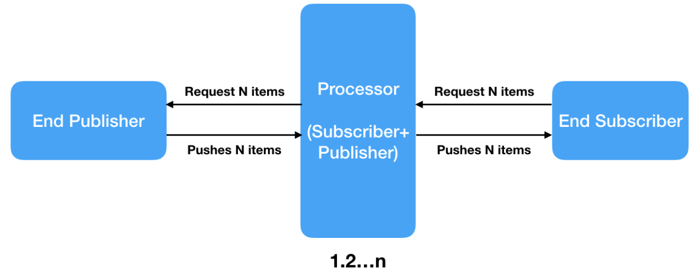

# Java 9

1. java 9 PEPL (JShell)
2. Factory Methods for Immutable List, Set, Map and Map.Entry
3. Private methods in Interfaces
4. Java 9 Module System
5. Process API Improvements
6. Try With Resources Improvement

-----

## 1. Java 9 REPL (JShell)

오라클에서 발표한 새로운 도구인 JShell은 Java Shell의 약어로, 클래스, 인터페이스, 열거형, 객체형, 문장형 등과 같은 Java Constructs를 쉽게 실행하거나 테스트할 수 있도록 지원하는 도구이다.

읽고(Read), 계산하고(Evaluate), 출력하는(Print) 반복 구조인 REPL(Read Evaluate Print Loop)이라고도 하며,이는 스크립트 언어(Interactive Interpreter Shell)들의 또 다른 명칭이다.

```
G:\>jshell
|	Welcome to JShell -- Version 9-ea
|	For an introduction type:	/help intro

jshell> int a = 10
a ==> 10

jshell> System.out.println("a value = " + a)
a value = 10
```

- Java 9 REPL Basics (Part-1)
- Java 9 REPL Features (Part-2)

-----

## 2. Factory Methods for Immutable List, Set, Map and Map.Entry 

기존 Java SE 8 이전 버전에서는 unmodifiable XXX와 같은 Collections 클래스 유틸리티 메소드를 사용하여 변경 불가능한 Collection 객체를 생성하였으나, 이러한 생성은 비교적 지루하고 장황한 접근법이다.

이러한 단점을 보완하기 위해 오라클은 불변(Immutable) List, Set, Map, Map.Entry 객체를 생성하기 위한 팩토리 메소드를 도입했다.

List와 Set 인터페이스는 ``of()`` 메소드 가지며, 이 메소드는 비어있거나, 비어있지 않은 불변의 List 또는 Set 객체를 생성하는데 사용된다.

```java
//	Empty List Example
List immutableList = List.of();

//	Non-Empty List Example
List immutableList = List.of("one", "two", "three");

//	Example: Java SE 8: Empty Immutable List
List<String> emptyList = new ArrayList<>():
List<String> immutableList = Collections.unmodifiableList(emptyList);
//	Example: Java SE 9: Empth Immutable List
List<String> immutableList = List.of();

//	Example: Java SE 8: Non-Empty Immutable List
List<String> list = new ArrayList<>();
list.add("one");
list.add("two");
list.add("three");
List<String> immutableList = Collections.unmodifiableList(list);
//	Example: Java SE 9: Non-Empty Immutable List
List<Sring> immutableList = List.of("one", "two", "three");

//	Example: Java SE 8: Immutable Empty Set
Set<String> emptySet = new HashSet<>();
Set<String> immutableSet = Collections.unmodifiableSet(emptySet);
//	Example: Java SE 9: Immutable Empty Set
Set<String> immutableSet = Set.of();

//	Example: Java SE 8: Immutable Non-Empty Set
Set<String> nonEmptySet = new HashSet<>();
nonEmptySet.add("one");
nonEmptySet.add("two");
nonEmptySet.add("three");
Set<String> immutableSet = Collections.unmodifiableSet(nonEmptySet);
//	Example: Java SE 9: Immutable Non-Empty Set
Set<String> immutableSet = Set.of("one", "two", "three");
```

Map은 불변 Map 객체와 불변 Map.Entry 객체를 만들기 위해 of() 메소드와 ofEntries() 메소드를 제공한다.

```java
//	Empty Map Example
Map emptyImmutableMap = Map.of();

//	Non-Empty Map Example
Map nonEmptyImmutableMap = Map.of(1, "one", 2, "two", 3, "three");

//	Example: Java SE 8: Immutable Empty Map
Map<Integer, String> emptyMap = new HashMap<>();
Map<Integer, String> immutableEmptyMap = Collections.unmodifiableMap(emptyMap);
//	Example: Java SE 9: Immutable Empty Map
Map<Integer, String> emptyImmutableEmptyMap = Map.of();

//	Example: Java SE 8: Immutable Non-Empty Map
Map<Integer, String> nonEmptyMap = new HashMap<>();
nonEmptyMap.put(1, "one");
nonEmptyMap.put(2, "two");
nonEmptyMap.put(3, "three");
Map<Integer, String> immutableNonEmptyMap = Collections.unmodifiableMap(nonEmptyMap);
//	Example: Java SE 9: Immutable Non-Empty Map
Map<Integer, String> nonEmptyImmutableMap = Map.of(1, "one", 2, "two", 3, "three");

//	Example: Java SE 9: Map.ofEntries(), Map.entry()
Map<Integer, String> emptyImmutableMap = Map.ofEntries();

Map<Integer, String> emptyImmutableMap = Map.ofEntries(entry(1, "one"), entry(2, "two"), entry(3, "three"));

Map.Entry(Integer, String) immutableMapEntry1 = Map.entry(1, "one");
Map.Entry(Integer, String) immutableMapEntry1 = Map.entry(2, "two");
Map.Entry(Integer, String) immutableMapEntry1 = Map.entry(3, "three");
Map<Integer, String> immutableMap = Map.ofEntries(immutableMapEntry1, immutableMapEntry2, immutableMapEntry3);
```

Map.ofEntries() 메소드는 불변 또는 수정할 수 없는 Map 객체를 만드는데에 사용된다. 

Map.entry() 유틸리티 메소드를 사용하여 지정된 키와 값의 쌍을 사용하여 불변의 Map.Entry를 생성할 수 있다.

```
대부분의 객체 지향 언어에서 객체는 참조(reference) 형태로 전달하고 받는다. Java, C++, Python, Ruby 등이 그 예이다. 객체가 참조를 통해 공유돼 있다면 그 상태가 언제든지 변경될 가능성도 커지므로 문제가 된다.

불변 객체는 객체를 복제할 때 객체 전체가 아니라 단순히 참조만 복사하고 끝난다. 참조는 보통 객체 그 자체보다 훨씬 작아서(전형적으로 포인터 크기), 메모리가 절감되며 프로그램의 성능에도 좋다. 가변 객체는 참조 복사 기법으로 다루기 곤란하다. 이유는 가변 객체의 참조를 가지고 있는 어떤 장소에서 객체를 변경하면 참조를 공유하는 모든 장소에서 그 영향을 받기 때문이다. 이것이 의도한 동작이 아니라면 참조를 가지고 있는 다른 장소에 변경 사실을 통지하고 대처하는 추가 대응이 필요하다. 이런 경우 비용은 조금 들지만 참조가 아닌 객체 전체를 방어적 복사(defensive copy) 하는 간단한 방법으로 대응할 수 있다. 또는, Observer 패턴을 가변 객체의 변경에 대처하는 방법으로 사용할 수 있다.

불변 객체는 멀티 스레드 프로그래밍에서도 유용하다. 데이터가 불변 객체에 저장돼 있다면 복수의 스레드에 의해서 특정한 스레드의 데이터가 변경될 우려없이 데이터에 접근할 수 있다. 즉, 배타 제어(mutual exclusion)를 할 필요가 없다. 쉽게 말해 불변 객체가 가변 객체보다 스레드 세이프(Thread-safe) 하다고 생각하면 된다.

객체 전체 대신 참조를 복제하는 기법은 인턴(intern, 문자열 객체를 만들면 매번 메모리에 새로운 객체가 만들어지는데 이를 인턴하여 문자열 풀 -String Pool-에 저장하고 그 뒤 같은 문자열이 호출되면 풀에서 참조를 복사해 반환하는 기법)으로 알려져 있다. 인턴이 사용되고 있다면 2개의 객체가 같다고 판단되는 경우는 참조가 같은 경우다.
```


-----

## 3. Private methods in Interfaces

추상 클래스는 구체화 시킬 구현체를 추상화시키는 기법이며, 인터페이스는 구현할 컴포넌트의 표준을 정의하는 것이다. 

추상 클래스와 인터페이스는 존재의 목적이 다르다. 추상 클래스는 그 추상 클래스를 상속받아서 기능을 이용하고 확장시키는데에 있으며, 인터페이스는 함수의 껍데기만 제공함으로써 해당 함수의 구현을 강제하기 위해서이다.

기본의 자바 8에서 인터페이스는 모든 메소드가 추상 메소드인 경우를 말하며, 메소드 시그니처와 상수 선언(static과 final이 둘 다 선언된 변수 선언)만 포함하거나, ``default`` 키워드를 이용해서 일반 메소드를 구현할 수 있다.

코드 중복을 피하고, 코드의 재사용을 위해 Java SE 9 이후부터는 ``private`` 키워드를 사용하여 인터페이스에 ``private`` 및 ``private static`` 메소드를 작성할 수 있다.

```java
public interface Calss {
  
  private Long function1() {
    //	Method implementation goes here.
  }
  
  private static void displayCardDetails() {
    //	Method implementation goes here.
  }
}
```

- Constant Variables
- Abstract Methods
- Default Methods
- Static Methods
- Private Methods
- Private Static Methods

-----

## 4. Java 9 Module System

```
Java 8에서는 classpath에 있는 모든 public type은 다른 어떤 type에서도 접근이 가능했으며, Jigsaw를 사용하면 Java의 type들에 대한 기존의 접근 방법이 public, private, default, protected에서 외부 모듈에서 public, 특정 모듈에서 public, 모듈 내부에서 public, private, default, protected으로 변한다.
```

오라클은 Jigsaw Project의 일환으로 아래의 기능을 도입할 예정이다.

- Modular JDK
- Modular Java Source Code
- Modular Run-time Images
- Encapsulate Java Internal APIs
- Java Platform Module System

기존의 Java SE 8가지는 Monolithic Jars를 사용하여 Java 기반 응용 프로그램을 개발했으며, 이 방식은 몇가지 제한과 단점이 존재하고, 이를 보완하기 위해 Java SE 9에서는 모듈 시스템으로 약 92개의 모듈을 제공한다.

Java SE 8까지의 시스템은 Java 기반 응용 프로그램을 개발하거나 제공할 때 여러가지 문제가 있었다.

- JDK가 너무 크기 때문에 소형 장치로 확장하기가 쉽지 않다.
- Jar 파일은 너무 커서 작은 장치 및 응용 프로그램에서 사용할 수 없다.
- jdk가 너무 크기 때문에 응용 프로그램 또는 다른 장치에서 더 나은 성능을 보이지 못한다.
- ``public`` 접근 제어자가 너무 개방적인 성격에 강한 캡슐화가 없다.
- jdk, jre가 너무 크기 때문에 응용 프로그램을 테스트하고 유지 관리하기 어렵다.
- ``public``의 지나친 개방으로 내부적인 비핵심 API에 대한 접근을 피할 수 없다.
- 사용자가 내부 API에 접근할 수 있으므로 보안에 문제가 있다.
- 응용 프로그램의 크기가 매우 크다.
- 구성 요소 사이에서 낮은 결합도를 유지하기 힘들다.

이러한 문제를 해결하기 위해 오라클은 Java SE 9에서 모듈 시스템을 도입했다.

- Jdk, jre, jar 등을 더 작은 모듈로 나누어, 원하는 모듈을 사용할 수 있게함으로써, Java 어플리케이션을 소형 장치에서 사용할 수 있다.
- 테스트 및 유지 보수의 용이성
- 성능 향상
- 기존의 단순한 ``public``이 아니며, 강력한 캡슐화 지원
- 내부 비핵심 API 접근 제어
- 모듈은 불필요한 내부 정보를 숨김으로써, 보안 강화
- 선택적인 모듈 사용으로 응용 프로그램의 크기 감소
- 구성 요소 간의 낮음 결합도 유지
- SRP를 쉽게 지원

Jdk 9에는 jre를 포함하지 않으며, jre가 별도의 배포 폴더로 분리되어 있다. Jdk 9 소프르웨어에는 "jmods"라는 폴더가 있고, java 9 모듈 세트가 들어 있다.

-----

## 5. Process API Improvements

Java SE 9에서는 Process API을 개선했고, 이를 통해 OS 프로세스의 제어와 관리를 쉽게하기 위해 몇 가지 새로운 클래스와 메소드를 추가했다.

- Java.lang.ProcessHandle
- Java.lang.ProcessHandle.Info

```java
ProcessHandle currentProcess = processHandle.current();
System.out.println("Current Process Id: " + currentProcess.getPid());
```

-----

## 6. Try With Resources Improvement

Java SE 7에서 새로운 예외 처리 구조인 Try-With-Resource를 도입하여 리소스를 자동으로 관리했으며, 이를 개선했다.

Java SE 9에서는 좀 더 자세한 정보를 피하고 가독성을 향상시키기 위해 명령문을 개선했다.

기존 Java SE 7보다 나은 예외 처리를 위해 Try-With-Resources 구조를 도입했으며, 이 구조를 통해 개발자의 코드가 중복되는 것을 막고, 리소스를 올바르게 닫음으로써 어플리케이션의 리소스 누출 문제를 예방한다.

- Syntactic Sugar
  - 일부 catch/finally 블록을 작성하지 않는다.
- 가독성 향상
  - Null 체크 불필요
- 더 나은 자원 관리
  - ARM(Autoimatic Resource Management)
- 메모리 누수 방지

```java
//	Example: Java SE 7
void testARM_Before_Java9() throws IOException {
    BufferedReader reader1 = new BufferedReader(new FileReader("journalDev.txt"));
    
    try(BufferedReader reader2 = reader) {
      System.out.println(reader2.readLine());
    }
}
```

Java SE 7, 8에서의 문제점은 위의 코드와 같이 BufferedReader 객체를 참조하는 reader1이 있더라도 Try-With-Resources에서 중복된 reader2를 만들어야 했다. Try-With-Resources 문구의 try () 블록 내에서 리소스를 사용하여 Try-With-Resources 외부에서 선언 된 리소스를 사용할 수 없었다.

```java
//	Example: Java SE 9
void testARM_Java9() throws IOException {
    BufferedReader reader1 = new BufferedReader(new FileReader("journalDev.txt"));
    
    try(reader1) {
       System.out.println(reader1.readLine())    
    }
}
```

-----

## 7. CompletableFuture API Improvements

자바 SE 9에서 자바 SE 8에서 지원했던 CompletableFuture API가 가지는 문제점을 개선했다. 오라클은 delays, timeouts, utility method, sub-classing 등의 추가 기능을 지원한다.

```java
Executor exe = ComplitableFuture.delayedExecutur(50L, TimeUint.SECONDS);
```

Executors는 작업(Task)들을 비동기적으로 실행 시킬 수 있으며 기본적으로 스레드 풀을 운영한다. delayedExecutor() 메소드는 특정 시간동안 딜레이 한 후, 기본 실행자로 보내진 new Executor를 반환하는 static 유틸리티 메소드이다. 

시간이 오래 걸리는 연산일 경우 비동기 방식을 통해 어플리케이션의 성틍과 반응성을 향상 시킬 수 있으며, CompletableFuture를 통해 쉽게 비동기 방식 API를 구현할 수 있다. 

CompletableFuture은 Future와 CompletionStage을 상속했으며, 각각의 클래스들의 특징을 담고있다. 

Future는 멀티스레드 환경에서 비동기 방식을 지원하며 동시성(Concurrency) 효율을 향상 시킬 수 있다. 

```
암달의 법칙
멀티 코어를 사용하는 프로그램의 속도는 프로그램 내부에서 존재하는 순차적(sequential) 부분이 사용하는 시간에 의해 제한된다.
```

스레드 간의 블럭이 많을수록 비효율적이며, 그것을 감소시키는 것이 동시성 프로그래밍의 목적이다.

메인 스레드에서 어떠한 작업을 다른 스레드에게 할당하여 작업이 완료될 때 까지 기다리는 블로킹(Blocking)이 아닌, 다른 일을 하고 있다가 다른 스레드의 작업이 끝나면 그 결과 값을 받는 형태의 방식을 의미한다.

CompletionStage는 동기식 또는 비동기식 계산 단위, 블록을 추상화하는 인터페이스이다. 여러 개의 ComplietionStage 또는 다른 작업 단위로 파이프 형태의 작업 흐름을 구성할 수 있다. 하나의 "stage" 작업(Task)이 "Completion"이 되면 또 다른 CompletionStage의 연산이 트리거 될 수 있다.

-----

## 8. Reactive Streams

반응형 프로그래밍(Reactive Programming)은 응용 프로그램을 개발하는데 매우 유익하다. Scala, Play, Akka 등의 프레임워크는 이미 Reactive Streams를 통함하여 많은 이점을 취하고 있다. 오라클은 Java SE 9에서 새로운 Reactive Streams API를 도입했다.

Reactive Streams API는 자바 언어를 사용하여 쉽게 비동기, 확장 가능, 병렬 프로그램을 구현하기 위한 Publish/Subscribe 프래임워크이다. 

- java.util.concurrent.Flow
- java.util.concurrent.Flow.Publisher
- java.util.concurrent.Flow.Subscriber
- java.util.concurrent.Flow.Processor

Java 9 Reactive Streams는 논블로킹 비동기 스트림 프로세싱(Non-blocking Asynchronous Stream Processing)을 구현할 수 있게 도와준다.

### Java 9 Reative Streams

Reactive Streams는 스트림의 비동기적 처리에 관한 것임으로, Publisher와 Subscriber가 필요하다. Publisher는 데이터의 스트림을 발행하며, Subscriber는 데이터를 사용한다.

Processor는 종단간의 Publisher와 Subscriber 사이의 개체를 의미하며, Publisher에게 받은 데이터를 Subscriber가 이해할 수 있도록 변환하는 역할을 한다.



### Java 9 Flow API

Java 9 Flow APIㄴ은 Reactive Streams Specification으로 구현됐다. Flow API는 이터레이터(Iterator)와 옵저버(Observer) 패턴으 조합으로, 이터레이터는 어플리케이션이 소스로부터 항목을 가져오는 풀(Pull) 모델에서 작동되며, 옵저버는 항목이 소스에서 어플리케이션으로 항목이 푸쉬될 때 반응하며, 푸쉬(Push) 모델이서 작동된다.

Java 9 Flow API에서 subscriber는 publisher에게 subscribing하는 동안 N개의 항목을 요청할 수 있다. 그럼 다음 푸쉬 할 항목이 더 이상 없거나 오류가 발생할 때까지 항목은 publisher에서 subscriber로 푸쉬된다.

- java.util.concurrent.Flow

  Flow API의 메인 클래스이다.

- java.util.concurrent.Flow.Publisher

- java.util.concurrent.Flow.Subscriber

  - onSubscribe
  - onNext
  - onError
  - onComplete

- java.util.concurrent.Flow.Subscription

  Publisher와 Subscriber 사이에서 비동기 논블로킹 링크를 생성하는데 사용된다. Subsriber는 request 메소드롤 호출함으로써 Publisher에게 특정 항목을 요구할 수 있으며, cancel 메소드를 호출함으로써 Publisher와 Subscriber 사이의 링크를 닫는 등의 구독 취소를 할 수 있다.

- java.util.concurrent.Flow.Processor

  Publisher와 Subscriber 사이를 확장하기 위한 인터페이스

- java.util.concurrent.SubmissionPublisher

  현재의 Subscriber가 연결을 닫을 때까지 비동기적으로 제출하는 Publisher 구현체이다. Executor 프레임워크를 사용한다.

Subscriber: 

```java
package com.journaldev.reactive_streams;

import java.util.concurrent.Flow.Subscriber;
import java.util.concurrent.Flow.Subscription;

import com.journaldev.reactive.beans.Employee;

public class MySubscriber implements Subscriber<Employee> {

	private Subscription subscription;
	
	private int counter = 0;
	
	@Override
	public void onSubscribe(Subscription subscription) {
		System.out.println("Subscribed");
		this.subscription = subscription;
		this.subscription.request(1); //requesting data from publisher
		System.out.println("onSubscribe requested 1 item");
	}

	@Override
	public void onNext(Employee item) {
		System.out.println("Processing Employee "+item);
		counter++;
		this.subscription.request(1);
	}

	@Override
	public void onError(Throwable e) {
		System.out.println("Some error happened");
		e.printStackTrace();
	}

	@Override
	public void onComplete() {
		System.out.println("All Processing Done");
	}

	public int getCounter() {
		return counter;
	}

}
```

Publisher:

```Java
package com.journaldev.reactive_streams;

import java.util.List;
import java.util.concurrent.SubmissionPublisher;

import com.journaldev.reactive.beans.Employee;

public class MyReactiveApp {

	public static void main(String args[]) throws InterruptedException {

		// Create Publisher
		SubmissionPublisher<Employee> publisher = new SubmissionPublisher<>();

		// Register Subscriber
		MySubscriber subs = new MySubscriber();
		publisher.subscribe(subs);

		List<Employee> emps = EmpHelper.getEmps();

		// Publish items
		System.out.println("Publishing Items to Subscriber");
		emps.stream().forEach(i -> publisher.submit(i));

		// logic to wait till processing of all messages are over
		while (emps.size() != subs.getCounter()) {
			Thread.sleep(10);
		}
		// close the Publisher
		publisher.close();

		System.out.println("Exiting the app");

	}

}
```

result:

```Java
Subscribed
Publishing Items to Subscriber
onSubscribe requested 1 item
Processing Employee [id=1,name=Pankaj]
Processing Employee [id=2,name=David]
Processing Employee [id=3,name=Lisa]
Processing Employee [id=4,name=Ram]
Processing Employee [id=5,name=Anupam]
Exiting the app
All Processing Done
```

-----

## 9. Diamond Operator for Anonymous Inner Class


 


-----

### ref

- [Java 9 Features with Examples](https://www.journaldev.com/13121/java-9-features-with-examples#module-system)


