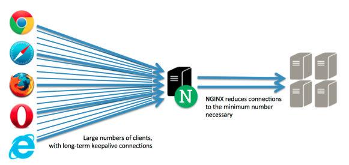

# Nginx

엔진엑스(Nginx)는 이고르 시쇼브(Igor Sysoev, 러시아 출신)에 의해 개발된 동시 접속 처리에 특화된 웹 서버 프로그램이다. 기존의 Apache 보다 동작이 단순하며, 전달자 역할을 통해 동시 접속 처리에 강점을 보인다. 동시 접속자가 대략 700명 이상의 경우, 서버를 증설하거나 Nginx 환경을 권장한다.

## Nginx(웹 서버)의 역할

- 정적 파일을 처리하는 HTTP 서버로서의 역할: 웹 서버의 역할은 HTML, CSS, Javascript, 이미지와 같은 정보를 웹 브라우저(Chrome, explore, Opera, Firefox 등)에 전송하는 역할을 한다.

- 어플리케이션 서버에 요청을 보내는 리버스 프록시 역할:	기본적은 리버스 프록시 기능을 지원한다. 클라이언트의 요청을 프록시 서버가 대신 수신하고 배후 서버(Reverse Server)에게 데이터를 요청한다. 여기서 프록시 서버가 Nginx가되며, 배후 서버(리버스 서버)가 어플리케이션 서버가 된다.

Nginx는 비동기 처리 방식(Event-Drive) 방식을 사용하고 있으며, 이를 프록시 서버로 활용함으로써 요청을 배분하는 형태가 된다.

------

### ref

- [Nginx의 개요](http://whatisthenext.tistory.com/123)

