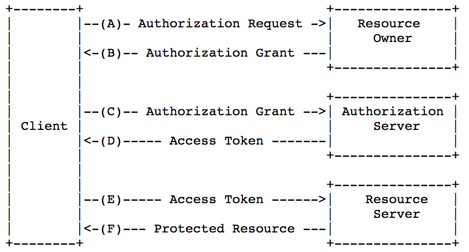
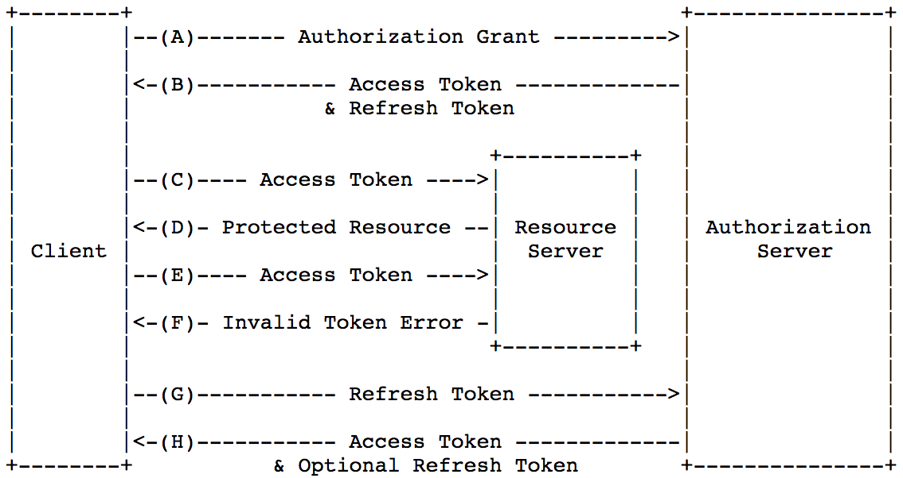

# OAuth (OAuth 2.0 Authorization Framework)

- 개요
- 개선 사항
- Ref

-----

## 개요

OAuth 2.0은 인증(Authentication)과 허가(Authorization)를 제공하는 서비스와 상호 연동하기 위한 프레임워크이다. 수많은 모바일 및 웹 어플리케이션에 폭 넓게 도입되었으며, OAuth 2.0에서 토큰의 형태를 규정하고 있지 않다.

OAuth의 구조는 액세스 토큰(Access Token)과 리프레쉬 토큰(Refresh Token)으로 두 가지 타입이 있다. 최초의 인증에서 사용자의 어플리케이션은 이 두 가지 토큰을 발급 받는다. 액세스 토큰은 비교작 짧은 시간으로, 무효화(expire)되도록 설정되어 있다. 최초의 액세스 토큰이 무효화되면 리프레쉬 토큰을 사용해서 새로운 토큰을 획득할 수 있다. 리프레쉬 토큰에도 유효 기간(Expiration)을 설정할 수 있다 액셋스 토큰과 리프레쉬 토큰 둘 다 내장된 보안을 가지고 있어 변조를 방지할 수 있다.

OAuth 2.0 인증 프레임워크르 사용하면 타사 응용 프로그램이 자원 소유자와 HTTP 서비스 간의 승인 상호 작용을 조정하여 자원 소유자를 대신하여 HTTP 서비스에 대한 제한된 액세스 권한을 얻거나 타사 응용 프로그램이 자체적으로 액세스 권한을 얻는다.

기존 클라이언트 - 서버 인증 모델에서 클라이언트는 자원 소유자의 신임 정보를 사용하여 서버로 인증하으로써 서버에서 액세스 제한 자원(보호 자원)을 요청한다. 제한된 자원에 대한 타사 응용 프로그램 액세스를 제공하기 위해 리소스 소유자는 해당 자격 증명을 타사와 공유한다.

-----

## OAuth

OAuth는 인터넷 사용자들이 비밀번호를 제공하지 않고 다른 웹 사이트 상의 자신들의 정보에 대해 웹 사이트나 어플리케이션의 접근 권한을 부여할 수 있는 공통적인 수단으로 사용되는 접근 위음을 위한 개방형 표준이다.

아마본, 구글, 페이스북, 마이크로소프트, 트위터 등에서 사용되며, 사용자들이 타사 어플리케이션이나 웹 사이트의 계정에 관한 정보를 공유할 수 있게 허용한다.

기본 인증인 아이디와 비밀번호는 보안상 취한한 구조이다. 기본 인증이 아닐 경우 각 어플리케이션등이 각자의 개발한 회사의 방법대로 사용자를 확인했다. OAuth는 이렇게 제각각인 인증 방식을 표준화한 인증 방식으로, OAuth를 이용하면 이 인증을 공유하는 어플리케이션끼리 별도의 인증이 필요없다. 여러 어플리케이션을 통합하여 사용하는 것이 가능하다.

- 사용자(user): 서비스 공급자와 소비자를 사용하는 계정을 가지고 있는 개인
- 소비자(consumer): Open API를 이용하여 개발된 OAturh를 사용하여 서비스 제공자에게 접근하는 웹 사이트 또는 어플리케이션
- 서비스 제공자(service provider): OAuth를 통해 접근을 지원하는 웹 어플리케이션(Open API를 제공하는 서비스)
- 소비자 비밀번호(consumer secret): 서비스 제공자에서 소비자가 자신임을 인증하기 위한 키
- 요청 토큰(request token): 소비자가 사용자에게 접근 권한을 인증받기 위해 필요한 정보가 담겨있으며 후에 접근 토큰으로 변환된다.
- 접근 토큰(access token): 인증 후에 사요자가 서비스 제공자가 아닌 소비자를 통해서 보호된 자원에 접근하기 위한 키를 포함한 값.

-----

## OAuth 2.0 Authorization Grant Type

권한 부여는 액세스 토큰을 얻기 위해 클라이언트가 사용하는 (보호 자원에 액세스 하기 위한) 자원 소유자의 권한을 나타내는 권한 정보이다. Authorization Code, Implicit, Resource Owner Password Credentials, Client Credentials와 같은 네가지 부여 유형과 추가 유형 정의를 위한 확장성 메커니즘이 있다.

### Authorization Code

권한 부여 코드(Authorization Code)는 클라이언트와 자원 소유자 사이에서 중개인으로 authorization server를 사용함으로써 얻을 수 있다. 클라이언트는 자원 소유자를 권한 서버로 향하게 하고 권한 서버는 자원 소유자를 권한 코드로 다시 클라이언트에게 보낸다.

### Implicit

Implicit Grant는 JavaScript와 같은 스크립팅 언어를 사용하여 브라우저에 구현된 클라이언트에 대해 최적화 및 단순회된 인증 코드 흐름이다. 클라이언트에게 권한 코드를 발행하는 대신 클라이언트에 직접 액세스 토큰이 발행된다.

### Resource Owner Password Credentials

자원 소유자 비밀번호 자격 증명은 액세스 권한을 얻기 위해 권한 부여로 직접 사용될 수 있다. 자격 증명은 리소스 소유자와 클라이언트가 다른 권한 부여 유형을 사용할 수 없고, 높은 신뢰도를 요구할 때 사용된다.

### Client Credentials

권한 부여 범위가 이전에 권한 서버와 함께 배치된 보호 자원 또는 클라이언트이 제어하에 있는 보호된 자원으로 제한되어 있는 경우 클라이언트 자격 증명을 권한 부여로 사용할 수 있다.

-----

## Access Token, Refresh Token

### Access Token

엑세스 토큰(Access Token)은 보호된 자원을 접근하기 위해 사용되는 자격을 증명한다. 엑세스 토큰은 클라이언트에게 발행하는 인증을 나타내는 문자열이다. 토큰은 특정 범위, 접근 기간, 자원 소유자에 의한 부여, 자원 서버와 권한 서버에 의한 강제 등을 나타낸다.

토큰은 권한 정보를 검색하기위해 사용되는 식별자를 의미하며, 가변적인 방법으로 권한 정보를 스스로 포함할 수  있다.(ex. 특정 데이터 또는 기호구성된 토큰 문자열) 해당 스팩의 범위를 넘는 추가적인 권한 증명은 토큰을 ㅁ사용하기 위한 클라이언트을 위해서 요구될 것이다.

엑세스 토큰은 자원 서버가 이해할 수 있는 단일 토큰으로 다른 권한 구조로 대체하는 추상화 레이어를 제공한다.(ex. username, password) 이 추상화는 그들을 얻기 해 사용되는 권한 부여보다 더욱 제한적으로 엑세스 토큰을 발행할 수 있을 뿐만 아니라, 다양한 인증 방법을 이해하기 위해 자원 서버의 필요성을 제거할 수 있다.

엑세스 토큰은 리소스 서버의 보안 요구사항을 기반으로 이용의 다른 형태, 구조, 방법(암호 속성) 등을 가질 수 있다. 엑세스 토큰 속성과 벙법은 보호된 자원을 사용할 수 있다. 

### Refresh Token

리프레시 토큰은(Refresh Token)은 엑세스 토큰을 얻기위해 사용되는 자격을 증명한다. 리프레시 토큰은 권한 부여 서버로부터 클라이언트에게 발행되며, 현재 기간이 만료되거나 유효하지 않은 엑세스 토큰일 때 새로운 엑세스 토큰을 얻기 위해 사용된다. 또한 같거나 더 좁은 범위의 엑세스 토큰을 추가적으로 얻는데에 사용된다. 리프레시 토큰은 발행하는 것은 부가적이며, 권한 부여 서버의 재량이다. 만약 권한 부여 서버가 리프레시 토큰을 발행한다면, 엑세스 토큰을 발행할 때 포함되어 있다.

리프레시 토큰은 자원 소유자로부터 클라이언트에게 권한을 부여하는 것을 나타내는 문자열이다. 문자열은 보통 클라이언트에게 불투명하다. 토큰은 권한 정보를 검색하는데 사용하되는 식별자를 의미한다. 엑세스 토큰과는 달리, 리프레시 토큰은 리소스 서버로 절대 보내지지 않고 오직 권한 부여 서버에서만 사용되도록 의도되었다.

-----

### ref

- [JWT 자바 가이드](https://medium.com/@OutOfBedlam/jwt-%EC%9E%90%EB%B0%94-%EA%B0%80%EC%9D%B4%EB%93%9C-53ccd7b2ba10)
- [OAuth2에 대해 알아보자](https://swalloow.github.io/about-oauth2)
- [OAuth](https://ko.wikipedia.org/wiki/OAuth)
- [The OAuth 2.0 Authorization Framework](https://tools.ietf.org/html/rfc6749)