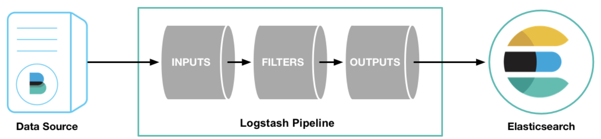

# Logstash

로그스테이시(Logstash) 파이프라인은 `input`과 `output`의 두 가지 필수 요소와 `filter`라는 선택적인 요소가 있다. `input` 플러그인은 소스로부터 데이터를 사용하고, `filter` 플러그인은 지정한대로 데이터를 수정하며, `output` 플러그인은 데이터를 대상에 쓴다.



-----

```
cd logstash-6.3.0
bin/logstash -e 'input { stdin { } } output { stdout { } }'
```

`-e` 플레그는 커멘드라인(command line)으로 직접 설정을 지정하기 위해 사용된다. 커멘드라인으로 지정하는 설정은 파일을 수정할 필요없이 설정을 신속하게 테스트할 수 있다. 위의 예제에서 파이프라인은 표준 입력(Standard Input)인 `stdin`에서 입력을 가져와서 그 입력을 표준 출력(Standard Output)으로 구조화된 형식으로 이동시킨다.

로그스테이시를 실행 한 후, 커멘드라인을 통해 `Hello World`를 입력하면 아래와 같이 결과 값을 얻을 수 있다.

```
//	input from the command line
Hello World

//	output
{
          "host" => "dhkimui-MacBook-Pro.local",
       "message" => "Hello World",
      "@version" => "1",
    "@timestamp" => 2018-07-03T14:07:19.286Z
}
```

로그스테이시는 메시지에 `timestamp`와 `IP address` 정보를 추가한다. 

-----


-----


-----


-----


-----

### ref

- [Logstash 6.3](https://www.elastic.co/guide/en/logstash/current/first-event.html)

