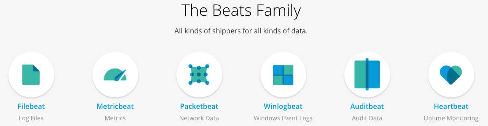

# Packetbeat Tutorial



엘라스틱서치에서는 다양한 유형의 데이터에 대한 다양한 유형의 수집기를 제공한다. 서버에 상주하는 프로그램으로 엘라스틱서치로 데이터를 수집하며, 추가적인 처리의 경우 변환 및 구문 분석을 위해 beats는 로그스테이시로 데이터를 수집 할 수 있다.

패킷비트(Packetbeat)는 유선으로 전송중인 데이터에 접근하여 어플리케이션에 어떤 일이 발생하고 있는지 확인할 수 있다.

-----

### Lightweight Shipper for Network Data

패킷비트(Packetbeat)는 로그스테이시(Logstash) 또는 엘라스틱서치(Elasticsearch)로 데이터를 보내기는 경량 네트워크 패킷 분석기이다.

### Monitor Services and Applications in Real Time

HTTP와 같은 네트워크 프로토콜은 어플리케이션의 대기 시간, 에러, 응답 시간, SLA(Service Level Agreement) 성능, 사용자 접근 패턴, 동향 등의 정보를 얻을 수 있다.

```
SLA Perfomance (Service Level Agreement)
SLA는 공급 업체의 고객이 기대하는 서비스 수준을 정의하고 해당 서비스를 측정하는 기준을 세우며 합의된 서비스 수준을 달성하지 못할 경우의 구제 조치 또는 처벌을 규정한다. 일반적으로 SLA는 회사와 외부 공급자 사이에 있지만 회사 내의 부서간에 있을 수 있다.
```

패킷비트는 데이터를 활용하고 네트워크를 통해 트래픽이 흐르는 방식을 이해하기 위해 실시간으로 해석한다.

페킷비트는 라이브러리이며, 데이터베이스부터 key-value 스토어, HTTP 및 저레벨 프로토콜까지 많은 어플리케이션 계층 프로토콜을 지원한다.


### Search and Analyze Network Traffic

데이터를 검색 및 분석에 적절한 형태로 변환하기 위해 다양한 작업을 거칠 필요 없이, 패킷비트가 대상 서버에서 실시간으로 수행한다.


### Ship to Elasticsearch or Logstash. Visualize in Kibana

패킷비트는 엘라스틱서치의 일부이며, 네트워크 데이터를 로그스테이시로 변환 또는 강화하거나, 엘라스틱서치에서 정교한 분석을 수행하거나, 키바나에서 대시보드를 구성 및 공유하는 경우 패킷비트가 데이터를 수집한다.

-----

## Getting started with Packetbeat

패킷비트를 사용하기 위해서는 데이터 저장 및 인덱싱을 위한 엘라스틱서치, UI용 키바나, 데이터 구문 분석 및 향상을 위한 로그스테이시가 필요하며, 로그스테이시는 생략할 수 있다.

### Install Packetbeat

[설치 참조](https://www.elastic.co/guide/en/beats/packetbeat/current/packetbeat-installation.html)

### Configure Packetbeat

1. 트래픽을 캡처 할 네트워크 인터페이스 선택

패킷비트는 패킷비트가 설치된 서버에서 송수신되는 모든 메시지를 캡처하는 것을 지원한다. OS X의 경우 어떤 장치에서도 캡처가 동작핮하지 않으며, 일반적으로 캡쳐할 트래픽에 따라 `lo0` 또는 `en0`을 사용한다.

```
#============================== Network device ================================

# Select the network interface to sniff the data. On Linux, you can use the
# "any" keyword to sniff on all connected interfaces.
packetbeat.interfaces.device: en0
```

2. 설정 파일의 프로토콜 섹션에서 패킷비트가 각 프로토콜을 찾을 수 있는 포트 설정

```
#========================== Transaction protocols =============================

packetbeat.protocols:
- type: icmp
  # Enable ICMPv4 and ICMPv6 monitoring. Default: false
  enabled: true

- type: amqp
  # Configure the ports where to listen for AMQP traffic. You can disable
  # the AMQP protocol by commenting out the list of ports.
  ports: [5672]

- type: cassandra
  #Cassandra port for traffic monitoring.
  ports: [9042]

- type: dns
  # Configure the ports where to listen for DNS traffic. You can disable
  # the DNS protocol by commenting out the list of ports.
  ports: [53]

  # include_authorities controls whether or not the dns.authorities field
  # (authority resource records) is added to messages.
  include_authorities: true

  # include_additionals controls whether or not the dns.additionals field
  # (additional resource records) is added to messages.
  include_additionals: true

- type: http
  # Configure the ports where to listen for HTTP traffic. You can disable
  # the HTTP protocol by commenting out the list of ports.
  ports: [80, 8080, 8000, 5000, 8002]

- type: memcache
  # Configure the ports where to listen for memcache traffic. You can disable
  # the Memcache protocol by commenting out the list of ports.
  ports: [11211]

- type: mysql
  # Configure the ports where to listen for MySQL traffic. You can disable
  # the MySQL protocol by commenting out the list of ports.
  ports: [3306]

- type: pgsql
  # Configure the ports where to listen for Pgsql traffic. You can disable
  # the Pgsql protocol by commenting out the list of ports.
  ports: [5432]

- type: redis
  # Configure the ports where to listen for Redis traffic. You can disable
  # the Redis protocol by commenting out the list of ports.
  ports: [6379]

- type: thrift
  # Configure the ports where to listen for Thrift-RPC traffic. You can disable
  # the Thrift-RPC protocol by commenting out the list of ports.
  ports: [9090]

- type: mongodb
  # Configure the ports where to listen for MongoDB traffic. You can disable
  # the MongoDB protocol by commenting out the list of ports.
  ports: [27017]

- type: nfs
  # Configure the ports where to listen for NFS traffic. You can disable
  # the NFS protocol by commenting out the list of ports.
  ports: [2049]

- type: tls
  # Configure the ports where to listen for TLS traffic. You can disable
  # the TLS protocol by commenting out the list of ports.
  ports: [443]
```

비표분 포트를 사용하는 경우 해당 섹션에 설정을 추가해야 하며, 그렇지 않을 경우 기본 값이 처리된다.

3. 출력을 엘라스틱서치에 직접 보내고 로그스테이시를 사용하지 않는 경우 패킷비트가 엘라스틱 서치를 찾을 수 있도록 IP 주소와 포트를 설정한다. 로그스테이시를 사용하는 경우 엘라스틱서치 출력 부분을 주석 처리하고 로그스테이시 출력 부분을 활성화 한다.

```
#================================ Outputs =====================================

# Configure what output to use when sending the data collected by the beat.

#-------------------------- Elasticsearch output ------------------------------
output.elasticsearch:
  # Array of hosts to connect to.
  hosts: ["localhost:9200"]

  # Optional protocol and basic auth credentials.
  #protocol: "https"
  #username: "elastic"
  #password: "changeme"

#----------------------------- Logstash output --------------------------------
#output.logstash:
  # The Logstash hosts
  #hosts: ["localhost:5044"]

  # Optional SSL. By default is off.
  # List of root certificates for HTTPS server verifications
  #ssl.certificate_authorities: ["/etc/pki/root/ca.pem"]

  # Certificate for SSL client authentication
  #ssl.certificate: "/etc/pki/client/cert.pem"

  # Client Certificate Key
  #ssl.key: "/etc/pki/client/cert.key"
```

4. 키바나의 대시보드를 사용하는 경우 아래와 같이 키바나를 설정한다.

```
#============================== Kibana =====================================

# Starting with Beats version 6.0.0, the dashboards are loaded via the Kibana API.
# This requires a Kibana endpoint configuration.
setup.kibana:

  # Kibana Host
  # Scheme and port can be left out and will be set to the default (http and 5601)
  # In case you specify and additional path, the scheme is required: http://localhost:5601/path
  # IPv6 addresses should always be defined as: https://[2001:db8::1]:5601
  #host: "localhost:5601"
```

여기서 `host`는 키바나가 실행중인 시스템의 호스트 이름과 포트이다. 포트 번호 다엠으 경로를 지정하면 아래와 같이 스키마와 포트를 포함시켜야 한다.

```
http://localhost:5601/path
```


구성 파일을 테스트하기 위해서는 패킷비트 바이너리가 설치된 디렉토리로 이동하여 포그라운드에서 옵션을 지정하여 패킷비트를 실행한다.

```
sudo ./packetbeat test config -e
```

설정 파일이 패킷비트에 의해 예상되는 경로에 있는지 확인하거나 `-c` 플래스를 통해 설정 파일의 경로를 지정할 수 있다.


-----

### ref

- [Packetbeat Reference](https://www.elastic.co/guide/en/beats/packetbeat/current/index.html)


