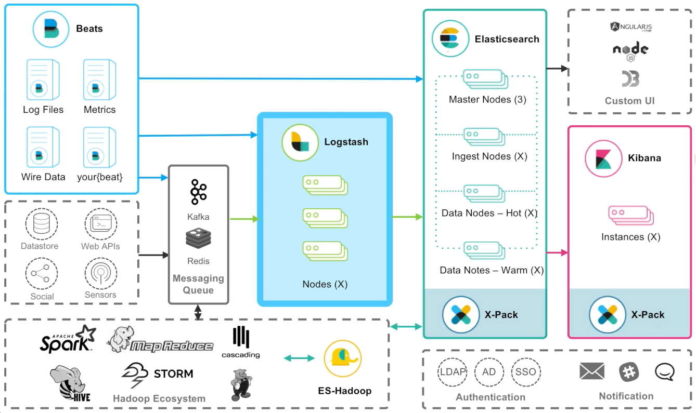

# Tutorial 2



beats는 가볍고 제한된 기능을 제공하며, Logstash는 그에 비해 무겁지만 다양한 기능을 지원한다. 

## Pipeline

- 복잡한 코딩은 배제하고 먼저 간단한 파이프라인 구성하기
- 빠른 시간 내에 첫 이벤트 시작하기
- 주기적이고 수평적인 확장

## Dataflow 엔진

데이터 흐름을 위한 중앙 처리 엔진

파이프라인을 구축하여 이벤트 제이터 변환 및 스트림 설정

## Data Source Discovery


로그나 파일의 경우 비츠를 사용하여 수집하는 것이 편리하다.

AWS, Web Apps, MQs(Message Queue), DB, IoT 등의 데이터를 로그스테이시로 모을 수 있다. 

## 파이프라인 강화

- 데이터스트림 실시간 변경, 제거 및 정규화
- 조건을 이용한 데이터 흐름 분할 및 라우팅
- 파이프라인 성능 및 활성 상태 모니터링
- 사용자 인증 및 SSL/TLS를 이용한 파이프라인 보안 적용

-----

## Concepts

### Configuration

파이프라인 (Pipeline): 데이터 처리를 위한 로그스테이시 설정

Input: 데이터가 유입되는 근원지

-  Files, Syslog, Sql Queries, Http request, Elasticsearch, Beats, Metrics systems ...

Filter: 데이터에 변형을 가함

- log 파싱, 데이터 확장, 태그 추가 ...

Output: 데이터를 전송할 목적지

- Elasticsearch, data 보관소, Alerting&Monitoring Systems ...

### Codec (인코딩, 디코딩)

데이터에 형태를 변환해주기 위해

- JSOn
- Avro
- msgpack
- Netflow
- CloudTrail

-----

## Configuration

### logstash.yml 

##### Pipeline Settings

- pipeline.workers - 더 많은 CPU 코어를 로그스테이시에게 할당할 수 있다.
- pipeline.output.workers - 더 많은 CPU 코어를 로그스테이시 output에 할당할 수 있다.
- pipeline.batch.size: 125 - 이벤트 데이터에 대해 몇 개씩 묶어서 배치를 할지에 대한 사이즈
- pipeline.batch.delay: 5 - 5/1000초마다 내가 만든 배치를 목적지로 던지겠다는 뜻

 ##### Pipeline configuration Settings

- config.reload.automatic - 로그스테이시가 별도의 재시작없이 미리 지정해둔 파이프라인 설정 파일을 리로드하겠다는 뜻
- config.reload.interval - config.reload.automatic 설정의 주기

로그스테이스는 주기에 따라 파이프라인 config 파일을 reload한다.


### pipelines.yml

파이프라인에 대한 설정을 지정해줌으로써 로그스테이시를 구동할 때 알아서 config 파일을 참고하여 실행된다. 

- - pipeline.id: xxx

  ​	path.config: xxxx

-----


bin/logstash -f 

-f 미리 만들어 놓은 파일을 사용하는 옵션


```
input {
    tcp {
        port => 9900
    }
}

filter {
    grok {
        match => {"message" => "Hello %{WORD: name}"}
    }
}

output {
    stdout {
        codec => rubydebug
    }
}
```


```
input {
    tcp {
        port => 9900
        type => "apache"
    }
}

filter {
    if [type] == "apache" {
    
        grok {
    		match => {
                message => "%{COMBINEDAPACHELOG}"
                remove_field => "message:
    		}        
        }
        
        geoip {
            source => "clientip"
            fields => ["city_name", "country_name", "location", "region_name"]
        }
        
        data {
            match => ["timestamp", "dd/MMM/yyyy:HH:mm:ss Z"]
            remove_field => "timestamp"
        }
    }
}

output {
	elasticsearch {
    	hosts => ["localhost:9200]
	}
}
```


filter grok 패턴로 필드 하나 추가 됨


아파치나 엔진엑스는 웹 로그(web log)를 남긴다.


-----

curl localhost:9600/_node?pretty

로그스테이시에서도 REST API를 지원함으로써 상태를 직접 확인할 수 있다.

-----


```
input {
    beats {
        port = 5044
    }
}

filter {
    grok {
        match => {
            "message" => "%{COMBINEDAPACHELOG}"
        }
    }
    
    geoip {
        source => "clientip"
    }
}

output {
    elasticsearch {
        hosts => "localhost:9200"
    }
}
```


```
input {
    jdbc {
        jdbc_user => "mysql"
        
        schedule => "*****"
        parameters => {"company" => "elastic"}
        use_column_value => true
        tracking_column => id
        
        statement => "SELECT * FROM my_table WHERE id > "sql_last_value"
    }
}
```


